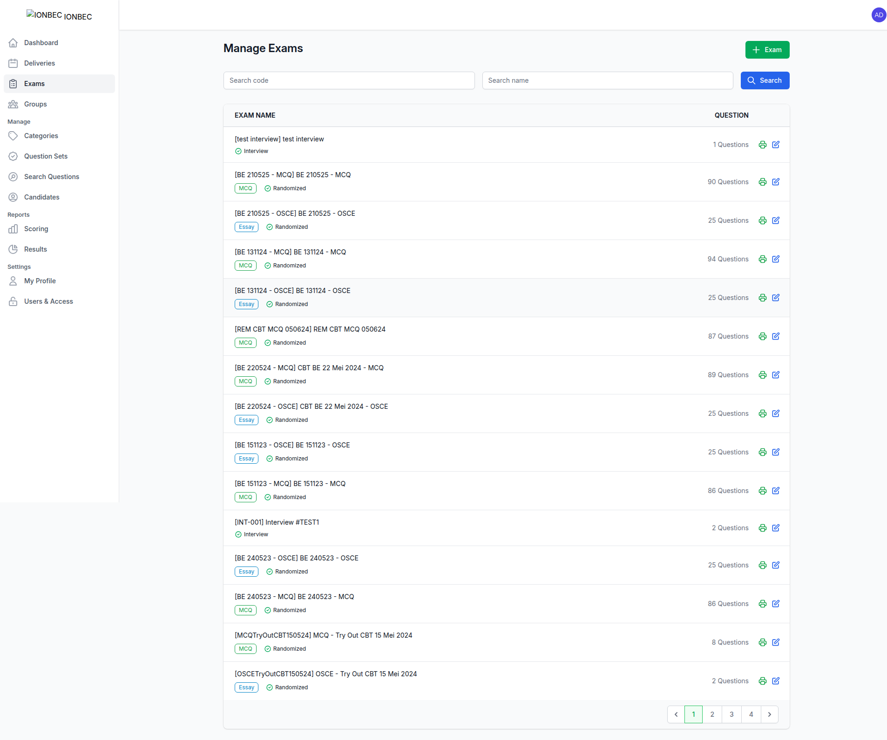
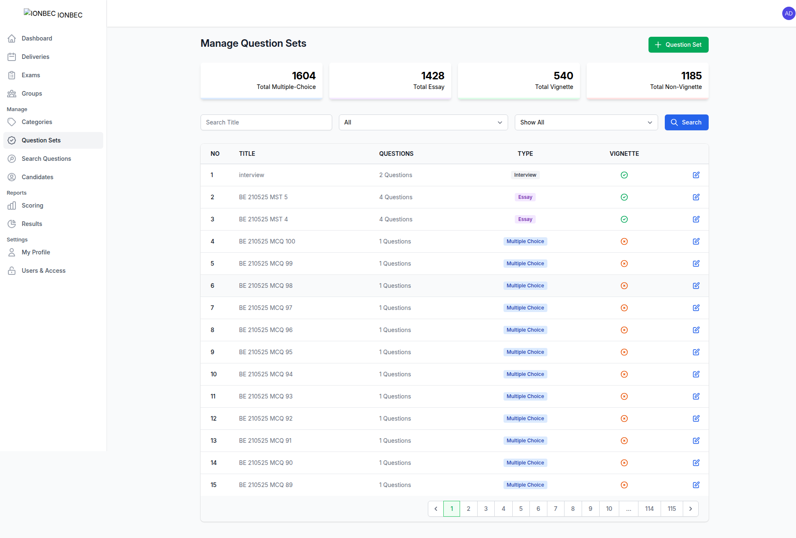
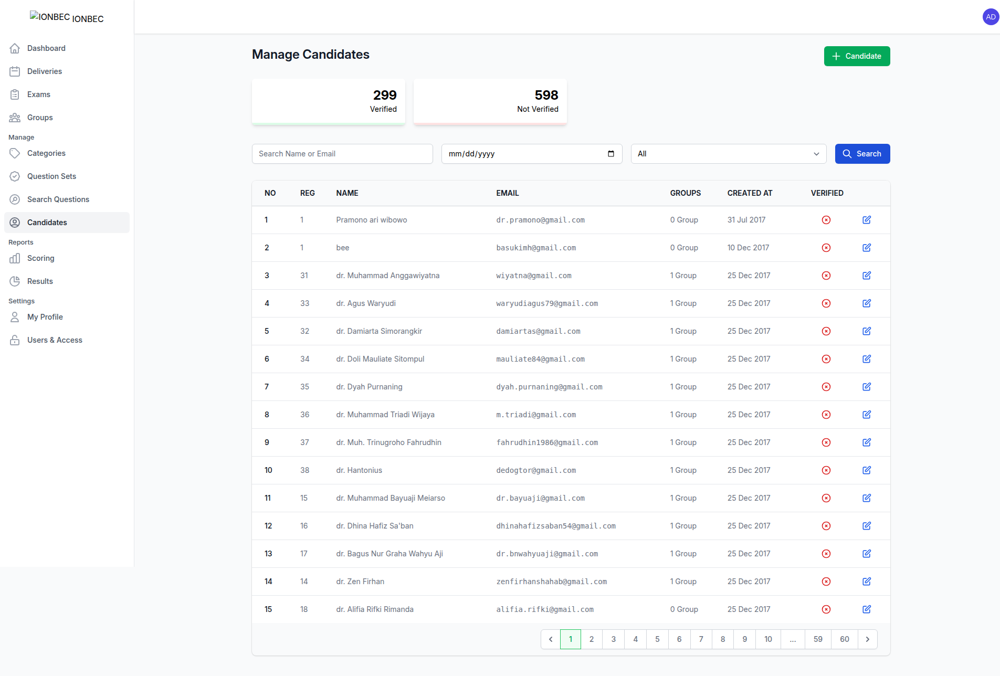

# Detailed Application Feature Documentation

**Application Name:** National Orthopaedic and Traumatology Board Examination (IoNbEc)
**Application URL:** http://io844g808o48ccsoscc888s0.107.155.75.50.sslip.io
**Documentation Date:** 2025-08-11T20:58:38.350Z
**Total Features Documented:** 24

---

## Executive Summary

This document provides comprehensive documentation of all features, forms, and functionalities available in the IoNbEc examination management system. Each section includes detailed field descriptions, available actions, and visual documentation through screenshots.

## Table of Contents

### Authentication & Access
- [Public Home Page](#public-home-page)
- [Administrator Login](#administrator-login)

### Dashboard & Overview
- [Administrator Dashboard](#administrator-dashboard)

### Exam Management
- [Delivery Management](#delivery-management)
- [Exam Configuration](#exam-configuration)

### Question Management
- [Question Categories](#question-categories)
- [Question Sets](#question-sets)
- [Question Set Details](#question-set-details)
- [Question Search & Filter](#question-search-&-filter)

### Participant Management
- [Group Management](#group-management)
- [Group Details & Members](#group-details-&-members)
- [Candidate Registration](#candidate-registration)

### Scoring & Results
- [Scoring Configuration](#scoring-configuration)
- [Scoring Details](#scoring-details)
- [Results Overview](#results-overview)
- [Detailed Results View](#detailed-results-view)

### User Management
- [User Profile Settings](#user-profile-settings)
- [User Access Control](#user-access-control)

### Forms & Data Entry
- [Create New Delivery Form](#create-new-delivery-form)
- [Create New Group Form](#create-new-group-form)
- [Register New Candidate Form](#register-new-candidate-form)
- [Create New Exam Form](#create-new-exam-form)
- [Create Question Category Form](#create-question-category-form)
- [Create Question Set Form](#create-question-set-form)

---

## Authentication & Access

### Public Home Page

**URL:** `http://io844g808o48ccsoscc888s0.107.155.75.50.sslip.io/`
**Page Title:** Welcome - IoNbEc
**Screenshot:** 

#### Action Buttons

- Submit

---

### Administrator Login

**URL:** `http://io844g808o48ccsoscc888s0.107.155.75.50.sslip.io/login`
**Page Title:** Sign in - IoNbEc
**Screenshot:** 

#### Forms

##### Form 1
- **Action:** http://io844g808o48ccsoscc888s0.107.155.75.50.sslip.io/login
- **Method:** get
- **Fields:**
  - **Username**
    - Type: text
    - Required: Yes
  - **Password**
    - Type: password
  - **remember**
    - Type: checkbox

#### Action Buttons

- Log in

---

## Dashboard & Overview

### Administrator Dashboard

**URL:** `http://io844g808o48ccsoscc888s0.107.155.75.50.sslip.io/back-office/dashboard`
**Page Title:** Dashboard - IoNbEc
**Screenshot:** 

#### Action Buttons

- Open sidebar
- Open user menu

#### Navigation Menu

- Dashboard
- Deliveries
- Exams
- Groups
- Categories
- Question Sets
- Search Questions
- Candidates
- Scoring
- Results
- My Profile
- Users & Access

#### Quick Actions

- New Delivery
- New Group
- Register Candidate
- New Test
- New Question Category
- New Question Set

---

## Exam Management

### Delivery Management

**URL:** `http://io844g808o48ccsoscc888s0.107.155.75.50.sslip.io/back-office/delivery`
**Page Title:** Manage Deliveries - IoNbEc
**Screenshot:** 

#### Data Tables

##### Table 1
- **Headers:** DELIVERY NAME, SCHEDULE, DURATION, STATUS, Action
- **Row Count:** 15

#### Action Buttons

- Open sidebar
- Open user menu
- Delivery
- Today
- Clear
- Search

#### Search & Filter Options

- Search name (input)

#### Navigation Menu

- Dashboard
- Deliveries
- Exams
- Groups
- Categories
- Question Sets
- Search Questions
- Candidates
- Scoring
- Results
- My Profile
- Users & Access
- Previous
- 1
- 2
- 3
- 4
- 5
- 6
- 7
- 8
- 9
- 10
- Next

---

### Exam Configuration

**URL:** `http://io844g808o48ccsoscc888s0.107.155.75.50.sslip.io/back-office/test`
**Page Title:** Manage Exams - IoNbEc
**Screenshot:** 

#### Data Tables

##### Table 1
- **Headers:** EXAM NAME, QUESTION, Action
- **Row Count:** 15

#### Action Buttons

- Open sidebar
- Open user menu
- Exam
- Search

#### Search & Filter Options

- Search code (input)
- Search name (input)

#### Navigation Menu

- Dashboard
- Deliveries
- Exams
- Groups
- Categories
- Question Sets
- Search Questions
- Candidates
- Scoring
- Results
- My Profile
- Users & Access
- Previous
- 1
- 2
- 3
- 4
- Next

---

## Question Management

### Question Categories

**URL:** `http://io844g808o48ccsoscc888s0.107.155.75.50.sslip.io/back-office/category`
**Page Title:** Manage Categories - IoNbEc
**Screenshot:** 

#### Data Tables

##### Table 1
- **Headers:** NO, NAME, TYPE, QUESTION, Edit
- **Row Count:** 15

#### Action Buttons

- Open sidebar
- Open user menu
- Category
- Search

#### Dropdown Filters

- **type**
  - Options: All, Disease Group, Region Group, Specific Part, Typical Group

#### Search & Filter Options

- Search Name (input)

#### Navigation Menu

- Dashboard
- Deliveries
- Exams
- Groups
- Categories
- Question Sets
- Search Questions
- Candidates
- Scoring
- Results
- My Profile
- Users & Access
- Previous
- 1
- 2
- 3
- Next

---

### Question Sets

**URL:** `http://io844g808o48ccsoscc888s0.107.155.75.50.sslip.io/back-office/question-set`
**Page Title:** Manage Question Sets - IoNbEc
**Screenshot:** 

#### Data Tables

##### Table 1
- **Headers:** NO, TITLE, QUESTIONS, TYPE, VIGNETTE, Edit
- **Row Count:** 15

#### Action Buttons

- Open sidebar
- Open user menu
- Search

#### Dropdown Filters

- **type**
  - Options: All, Simple, Multiple Choice, Essay, Interview
- **type**
  - Options: Show All, Vignette, Non Vignette

#### Search & Filter Options

- Search Title (input)

#### Navigation Menu

- Dashboard
- Deliveries
- Exams
- Groups
- Categories
- Question Sets
- Search Questions
- Candidates
- Scoring
- Results
- My Profile
- Users & Access
- Previous
- 1
- 2
- 3
- 4
- 5
- 6
- 7
- 8
- 9
- 10
- ...
- 114
- 115
- Next

#### Quick Actions

- Question Set

---

### Question Set Details

**URL:** `http://io844g808o48ccsoscc888s0.107.155.75.50.sslip.io/back-office/question-set/OVblvXGg?name=back-office.question-set.index&params=page&values=1`
**Page Title:** Authoring Question Set - IoNbEc
**Screenshot:** 

#### Action Buttons

- Open sidebar
- Open user menu
- Show Stats
- Upload an Image
- Add a Question
- Save Changes

#### Dropdown Filters

- ****
  - Options: Multiple Choice, Essay, Interview
- **disease-group-0**
  - Options: 13 items available
- **region-group-0**
  - Options: 22 items available
- **typical-group-0**
  - Options: Select Typical Group, Unspecified, Analysis, Recall Type
- **specific-part-0**
  - Options: Select Specific Part, Unspecified, Pathogenesis, Diagnosis/Investigation, Treatment/Management, Prognosis and Complication
- **disease-group-1**
  - Options: 13 items available
- **region-group-1**
  - Options: 22 items available
- **typical-group-1**
  - Options: Select Typical Group, Unspecified, Analysis, Recall Type
- **specific-part-1**
  - Options: Select Specific Part, Unspecified, Pathogenesis, Diagnosis/Investigation, Treatment/Management, Prognosis and Complication

#### Search & Filter Options

- Search Tests (input)

#### Navigation Menu

- Dashboard
- Deliveries
- Exams
- Groups
- Categories
- Question Sets
- Search Questions
- Candidates
- Scoring
- Results
- My Profile
- Users & Access

---

### Question Search & Filter

**URL:** `http://io844g808o48ccsoscc888s0.107.155.75.50.sslip.io/back-office/question-pack`
**Page Title:** Manage Question Pack - IoNbEc
**Screenshot:** 

#### Action Buttons

- Open sidebar
- Open user menu
- Search

#### Dropdown Filters

- ****
  - Options: 13 items available
- ****
  - Options: 22 items available
- ****
  - Options: Select Specific Part, Unspecified, Pathogenesis, Diagnosis/Investigation, Treatment/Management, Prognosis and Complication
- ****
  - Options: Select Typical Group, Unspecified, Analysis, Recall Type
- ****
  - Options: Show all, Multiple Choice, Essay

#### Search & Filter Options

- Search question (input)

#### Navigation Menu

- Dashboard
- Deliveries
- Exams
- Groups
- Categories
- Question Sets
- Search Questions
- Candidates
- Scoring
- Results
- My Profile
- Users & Access
- Previous
- 1
- 2
- 3
- 4
- 5
- 6
- 7
- 8
- 9
- 10
- ...
- 202
- 203
- Next

---

## Participant Management

### Group Management

**URL:** `http://io844g808o48ccsoscc888s0.107.155.75.50.sslip.io/back-office/group`
**Page Title:** Manage Groups - IoNbEc
**Screenshot:** 

#### Data Tables

##### Table 1
- **Headers:** NO, GROUP NAME, CODE, PARTICIPANTS, Action
- **Row Count:** 15

#### Action Buttons

- Open sidebar
- Open user menu
- Group
- Search

#### Search & Filter Options

- Search group name or description (input)

#### Navigation Menu

- Dashboard
- Deliveries
- Exams
- Groups
- Categories
- Question Sets
- Search Questions
- Candidates
- Scoring
- Results
- My Profile
- Users & Access
- Previous
- 1
- 2
- 3
- 4
- 5
- Next

---

### Group Details & Members

**URL:** `http://io844g808o48ccsoscc888s0.107.155.75.50.sslip.io/back-office/group/l5mnrpmj/takers?name=back-office.group.index&params=page&values=1`
**Page Title:** Authoring Group - IoNbEc
**Screenshot:** 

#### Data Tables

##### Table 1
- **Headers:** NO, CODE, NAME, EMAIL, Edit
- **Row Count:** 1

#### Action Buttons

- Open sidebar
- Open user menu
- Search

#### Search & Filter Options

- Search Candidate (input)
- Search Name or Email (input)

#### Navigation Menu

- Dashboard
- Deliveries
- Exams
- Groups
- Categories
- Question Sets
- Search Questions
- Candidates
- Scoring
- Results
- My Profile
- Users & Access
- Candidates
- Deliveries
- Results
- Previous
- 1
- Next

---

### Candidate Registration

**URL:** `http://io844g808o48ccsoscc888s0.107.155.75.50.sslip.io/back-office/test-taker`
**Page Title:** Manage Candidates - IoNbEc
**Screenshot:** 

#### Data Tables

##### Table 1
- **Headers:** NO, REG, NAME, EMAIL, GROUPS, CREATED AT, VERIFIED, Edit
- **Row Count:** 15

#### Action Buttons

- Open sidebar
- Open user menu
- Candidate
- Search

#### Dropdown Filters

- ****
  - Options: 70 items available

#### Search & Filter Options

- Search Name or Email (input)

#### Navigation Menu

- Dashboard
- Deliveries
- Exams
- Groups
- Categories
- Question Sets
- Search Questions
- Candidates
- Scoring
- Results
- My Profile
- Users & Access
- Previous
- 1
- 2
- 3
- 4
- 5
- 6
- 7
- 8
- 9
- 10
- ...
- 59
- 60
- Next

---

## Scoring & Results

### Scoring Configuration

**URL:** `http://io844g808o48ccsoscc888s0.107.155.75.50.sslip.io/back-office/scoring`
**Page Title:** Scoring of Deliveries - IoNbEc
**Screenshot:** 

#### Data Tables

##### Table 1
- **Headers:** DELIVERY NAME, SCHEDULE, DURATION, STATUS, Edit
- **Row Count:** 15

#### Action Buttons

- Open sidebar
- Open user menu
- Today
- Clear
- Search

#### Search & Filter Options

- Search a Name (input)

#### Navigation Menu

- Dashboard
- Deliveries
- Exams
- Groups
- Categories
- Question Sets
- Search Questions
- Candidates
- Scoring
- Results
- My Profile
- Users & Access
- Previous
- 1
- 2
- 3
- 4
- 5
- 6
- 7
- 8
- 9
- 10
- Next

---

### Scoring Details

**URL:** `http://io844g808o48ccsoscc888s0.107.155.75.50.sslip.io/back-office/scoring/dx3PV0Zz?name=back-office.scoring.index&params=page&values=1`
**Page Title:** Scoring Detail - IoNbEc
**Screenshot:** 

#### Data Tables

##### Table 1
- **Headers:** NO, CODE, PROGRESS, ATTEMPTED AT, STATUS SCORING, SCORE, download
- **Row Count:** 1

#### Action Buttons

- Open sidebar
- Open user menu
- Search

#### Search & Filter Options

- Search Code or Email (input)

#### Navigation Menu

- Dashboard
- Deliveries
- Exams
- Groups
- Categories
- Question Sets
- Search Questions
- Candidates
- Scoring
- Results
- My Profile
- Users & Access
- Previous
- 1
- Next

---

### Results Overview

**URL:** `http://io844g808o48ccsoscc888s0.107.155.75.50.sslip.io/back-office/result`
**Page Title:** Result of Groups - IoNbEc
**Screenshot:** 

#### Data Tables

##### Table 1
- **Headers:** NO, NAME, PARTICIPANTS, Edit
- **Row Count:** 15

#### Action Buttons

- Open sidebar
- Open user menu
- Search

#### Search & Filter Options

- Search Name or Description (input)

#### Navigation Menu

- Dashboard
- Deliveries
- Exams
- Groups
- Categories
- Question Sets
- Search Questions
- Candidates
- Scoring
- Results
- My Profile
- Users & Access
- Previous
- 1
- 2
- 3
- 4
- 5
- Next

---

### Detailed Results View

**URL:** `http://io844g808o48ccsoscc888s0.107.155.75.50.sslip.io/back-office/result/l5mnrpmj`
**Page Title:** Result - IoNbEc
**Screenshot:** 

#### Data Tables

##### Table 1
- **Headers:** No, CODE, SUMMARY, Test Agustus (BE 210525 - MCQ)02 Aug 2025, SUMMARY
- **Row Count:** 1

#### Action Buttons

- Open sidebar
- Open user menu
- Search

#### Search & Filter Options

- Search Code or Email (input)

#### Navigation Menu

- Dashboard
- Deliveries
- Exams
- Groups
- Categories
- Question Sets
- Search Questions
- Candidates
- Scoring
- Results
- My Profile
- Users & Access
- Previous
- 1
- Next

---

## User Management

### User Profile Settings

**URL:** `http://io844g808o48ccsoscc888s0.107.155.75.50.sslip.io/back-office/profile`
**Page Title:** My Profile - IoNbEc
**Screenshot:** 

#### Action Buttons

- Open sidebar
- Open user menu
- Today
- Save
- Update

#### Navigation Menu

- Dashboard
- Deliveries
- Exams
- Groups
- Categories
- Question Sets
- Search Questions
- Candidates
- Scoring
- Results
- My Profile
- Users & Access

---

### User Access Control

**URL:** `http://io844g808o48ccsoscc888s0.107.155.75.50.sslip.io/back-office/user`
**Page Title:** Manage User - IoNbEc
**Screenshot:** 

#### Data Tables

##### Table 1
- **Headers:** NO, NAME, EMAIL, Edit
- **Row Count:** 15

#### Action Buttons

- Open sidebar
- Open user menu
- User
- Search

#### Dropdown Filters

- **role**
  - Options: All, Administrator, Scorer / Committee

#### Search & Filter Options

- Search Name or Email (input)

#### Navigation Menu

- Dashboard
- Deliveries
- Exams
- Groups
- Categories
- Question Sets
- Search Questions
- Candidates
- Scoring
- Results
- My Profile
- Users & Access
- Previous
- 1
- 2
- 3
- 4
- Next

---

## Forms & Data Entry

### Create New Delivery Form

**URL:** `http://io844g808o48ccsoscc888s0.107.155.75.50.sslip.io/back-office/delivery?modal_create=1`
**Page Title:** Manage Deliveries - IoNbEc
**Screenshot:** 

#### Data Tables

##### Table 1
- **Headers:** DELIVERY NAME, SCHEDULE, DURATION, STATUS, Action
- **Row Count:** 15

#### Action Buttons

- Open sidebar
- Open user menu
- Delivery
- Today
- Clear
- Search
- Cancel
- Save

#### Search & Filter Options

- Search name (input)
- Search Test (input)
- Search Group (input)

#### Navigation Menu

- Dashboard
- Deliveries
- Exams
- Groups
- Categories
- Question Sets
- Search Questions
- Candidates
- Scoring
- Results
- My Profile
- Users & Access
- Previous
- 1
- 2
- 3
- 4
- 5
- 6
- 7
- 8
- 9
- 10
- Next

#### Quick Actions

- 1
- 2
- 3
- 4
- 5
- 6
- 7
- 8
- 9
- 10
- Next

---

### Create New Group Form

**URL:** `http://io844g808o48ccsoscc888s0.107.155.75.50.sslip.io/back-office/group?modal_create=1`
**Page Title:** Manage Groups - IoNbEc
**Screenshot:** 

#### Data Tables

##### Table 1
- **Headers:** NO, GROUP NAME, CODE, PARTICIPANTS, Action
- **Row Count:** 15

#### Action Buttons

- Open sidebar
- Open user menu
- Group
- Search
- Today
- Cancel
- Save

#### Search & Filter Options

- Search group name or description (input)

#### Navigation Menu

- Dashboard
- Deliveries
- Exams
- Groups
- Categories
- Question Sets
- Search Questions
- Candidates
- Scoring
- Results
- My Profile
- Users & Access
- Previous
- 1
- 2
- 3
- 4
- 5
- Next

#### Quick Actions

- 1
- 2
- 3
- 4
- 5
- Next

---

### Register New Candidate Form

**URL:** `http://io844g808o48ccsoscc888s0.107.155.75.50.sslip.io/back-office/test-taker?modal_create=1`
**Page Title:** Manage Candidates - IoNbEc
**Screenshot:** 

#### Data Tables

##### Table 1
- **Headers:** NO, REG, NAME, EMAIL, GROUPS, CREATED AT, VERIFIED, Edit
- **Row Count:** 15

#### Action Buttons

- Open sidebar
- Open user menu
- Candidate
- Search
- Cancel
- Save

#### Dropdown Filters

- ****
  - Options: 70 items available

#### Search & Filter Options

- Search Name or Email (input)
- Search Group (input)

#### Navigation Menu

- Dashboard
- Deliveries
- Exams
- Groups
- Categories
- Question Sets
- Search Questions
- Candidates
- Scoring
- Results
- My Profile
- Users & Access
- Previous
- 1
- 2
- 3
- 4
- 5
- 6
- 7
- 8
- 9
- 10
- ...
- 59
- 60
- Next

#### Quick Actions

- 1
- 2
- 3
- 4
- 5
- 6
- 7
- 8
- 9
- 10
- 59
- 60
- Next

---

### Create New Exam Form

**URL:** `http://io844g808o48ccsoscc888s0.107.155.75.50.sslip.io/back-office/test?modal_create=1`
**Page Title:** Manage Exams - IoNbEc
**Screenshot:** 

#### Data Tables

##### Table 1
- **Headers:** EXAM NAME, QUESTION, Action
- **Row Count:** 15

#### Action Buttons

- Open sidebar
- Open user menu
- Exam
- Search
- Cancel
- Save

#### Search & Filter Options

- Search code (input)
- Search name (input)

#### Navigation Menu

- Dashboard
- Deliveries
- Exams
- Groups
- Categories
- Question Sets
- Search Questions
- Candidates
- Scoring
- Results
- My Profile
- Users & Access
- Previous
- 1
- 2
- 3
- 4
- Next

#### Quick Actions

- 1
- 2
- 3
- 4
- Next

---

### Create Question Category Form

**URL:** `http://io844g808o48ccsoscc888s0.107.155.75.50.sslip.io/back-office/category?modal_create=1`
**Page Title:** Manage Categories - IoNbEc
**Screenshot:** 

#### Data Tables

##### Table 1
- **Headers:** NO, NAME, TYPE, QUESTION, Edit
- **Row Count:** 15

#### Action Buttons

- Open sidebar
- Open user menu
- Category
- Search
- Cancel
- Save

#### Dropdown Filters

- **type**
  - Options: All, Disease Group, Region Group, Specific Part, Typical Group
- **type**
  - Options: Disease Group, Region Group, Specific Part, Typical Group

#### Search & Filter Options

- Search Name (input)

#### Navigation Menu

- Dashboard
- Deliveries
- Exams
- Groups
- Categories
- Question Sets
- Search Questions
- Candidates
- Scoring
- Results
- My Profile
- Users & Access
- Previous
- 1
- 2
- 3
- Next

#### Quick Actions

- 1
- 2
- 3
- Next

---

### Create Question Set Form

**URL:** `http://io844g808o48ccsoscc888s0.107.155.75.50.sslip.io/back-office/question-set?modal_create=1`
**Page Title:** Manage Question Sets - IoNbEc
**Screenshot:** 

#### Data Tables

##### Table 1
- **Headers:** NO, TITLE, QUESTIONS, TYPE, VIGNETTE, Edit
- **Row Count:** 15

#### Action Buttons

- Open sidebar
- Open user menu
- Search

#### Dropdown Filters

- **type**
  - Options: All, Simple, Multiple Choice, Essay, Interview
- **type**
  - Options: Show All, Vignette, Non Vignette

#### Search & Filter Options

- Search Title (input)

#### Navigation Menu

- Dashboard
- Deliveries
- Exams
- Groups
- Categories
- Question Sets
- Search Questions
- Candidates
- Scoring
- Results
- My Profile
- Users & Access
- Previous
- 1
- 2
- 3
- 4
- 5
- 6
- 7
- 8
- 9
- 10
- ...
- 114
- 115
- Next

#### Quick Actions

- Question Set
- 1
- 2
- 3
- 4
- 5
- 6
- 7
- 8
- 9
- 10
- 114
- 115
- Next

---

